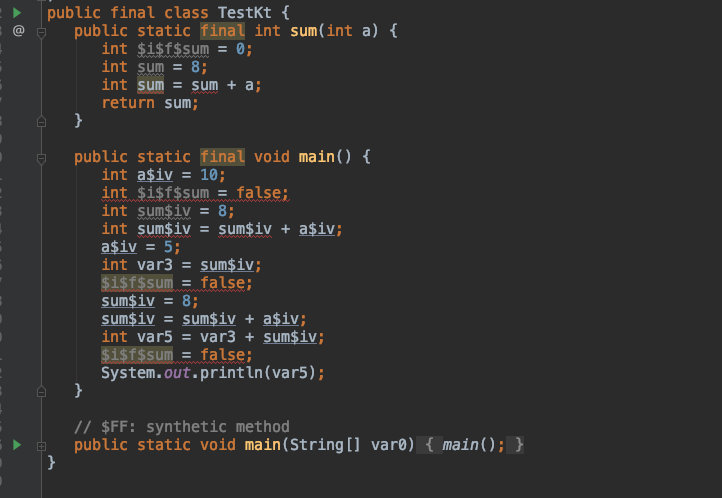

# 数据

## 基本数据类型

Kotlin的基本数值类型包括`Byte`、`Short`、`Int`、`Long`、`Float`、`Double`、`Bool`等。不同于Java，字符不属于数值类型，是一个独立的数据类型。

## 字面常量
  - 十进制 ：123
  - 长整型以大写的L结尾：123L
  - 16进制以0X开头：0x0F
  - 2进制以0b开头：0b00001011
  - ***8进制不支持***

## 浮点数值
  - `Double`的默认写法：123.5,  123.5e10
  - `Float`使用f或者F结尾：123.5f 

## 布尔类型
Kotlin的布尔类型和java一样只有两个值，用true和false表示。
```kotlin
val isTrue : Boolean = true
val isFalse : Boolean= false
```
## 数组类型
数组用类 Array 实现，并且还有一个 size 属性及 get 和 set 方法，由于使用 [] 重载了 get 和 set 方法，所以我们可以通过下标很方便的获取或者设置数组对应位置的值。
数组的创建两种方式：一种是使用函数arrayOf()；另外一种是使用工厂函数。如下所示，我们分别是两种方式创建了两个数组：
### 数组的创建

```kotlin
var a = Array(5,{0})                           // 创建指定长度的数组，初始化长度为5，元素均为0.
for (i in 0..4) {//给数组赋值
    a[i] = i+1
}
var b = Array(5,{0;1})                         // 创建指定长度的数组，初始化长度为5，元素均为1.
for (i in 0..4) {//给数组赋值
    b[i] = i+1
}
        
var c : Array<Int> = Array(5,{ i -> i+1})     //使用闭包创建数组。初始化长度为5，元素为1,2,3,4,5
var d : Array<Int> = arrayOf(1, 2, 3,4,5)     //使用Kotlin封装方法创建数组,元素为1,2,3,4,5
var e : IntArray = intArrayOf(1,2,3,4,5)      //使用Kotlin封装方法创建数组,元素为1,2,3,4,5
        
//其它基本类型的数组声明与之类似，只要把int替换为long、float、double、boolean、char即可。
var f: Array<Char> = arrayOf('1', '2', '3')
var g: CharArray = charArrayOf('1', '2', '3')
        
//这里还有一个注意的点,String类型的数组只能通过arrayOf或者Array去创建，没有stringArrayOf
var h: Array<String> = arrayOf("1", "2", "3")
var i: Array<String> = Array(3, { "0" })
for (n in 0..2) {//给数组赋值
    i[n] = (n+1).toString()
}
           
```
### 数组的遍历
```kotlin
var h: Array<String> = arrayOf("1", "2", "3")
// 遍历数组元素
 for (item in h) {
     println(item)
 }
// 遍历数组下标
for (item in h.indices) {
    println(item)
}
// 迭代器遍历数组1
val it = h.iterator()
for (item in it.iterator()) {
    println(item)
}
// 迭代器遍历数组2
val it1 = h.iterator()
it1.forEach {
      println(it)
}
// forEach遍历数组
h.forEach {
    println(it)
}
```

## 字符类型
和 Java 不一样，Kotlin 中的 Char 不能直接和数字操作，Char 必需是单引号 ' 包含起来的。比如普通字符 '0'，'a'。
```kotlin
fun check(c : Char){
//        if(c == 97){//Kotlin中不可以这么写，编译不通过
//
//        }
if(c.toInt() == 97){
    println(c)
 }
if(c == 'a'){
    println(c)
   }
}
    
```
字符字面值用单引号括起来: '1'。 特殊字符可以用反斜杠转义。 

支持这几个转义序列：\t-->制表符;\b-->退格符;\n-->换行符;\r-->回车符;\'-->单引符;\"-->双引符;\\-->反斜杠。
编码其他字符要用 Unicode 转义序列语法：'\uFF00'。


## 字符串类型
字符串 用String 类型表示。字符面值用双引号括起来："我是字符串"，如果是转义字符串，可以参考java，很像。
字字符串是不可变的。 字符串的元素——字符可以使用索引运算符访问: s[i]。
```kotlin
 val s = "Hello, world!"
```
### 原生字符串 使用三个引号（"""）分界符括起来，内部没有转义并且可以包含换行和任何其他字符:
```kotlin
 val text = """
      |Tell me and I forget.
      |Teach me and I remember.
      |Involve me and I learn.
      |(Benjamin Franklin) 
    """
```
### 字符串相加 ；字符串和字符相加
```kotlin
var str = "one"+ 'd'+ "two" + 't'
```
##  元组（Tuple）

给多个变量同时赋值，分二元（Pair）和三元（Triple）
```kotlin
val (year ,month,day) = Triple(2017,"6月","14号")
println("${year}年${month}${day}")
val date1 = Triple(2017,"6月","14号")
println("${date1.first}年${date1.second}${date1.third}")
//二元同上，把Triple换成Pair
```

## 字符串模板

字符串模板：各种变量组合成一个动态的字符串，模板表达式以美元符（$）开头，由一个简单的名字构成
```kotlin
val i = 10
println("i等于${i}")
//原生字符串和转义字符串内部都支持模板。 如果你需要在原生字符串中表示字面值 $ 字符（它不支持反斜杠转义），你可以用下列语法：
println("小米价格是${'$'}${i}")
```

# 变量

Kotlin中使用`var`/`val`关键字来声明变量

- `var`关键字声明的是可变变量
- `val`关键字声明的是只读变量

```kotlin
//可变变量声明关键字var
var name: String = "小明"     
//不指定变量类型的隐式声明
var age = 10   
//只读变量声明关键字val
val sex: String = "男" 
```

## 自动类型推导

Kotlin中编译器可以通过变量的值来自动推导变量是什么类型的，这种功能称为自动类型推导，不指定变量类型的声明方式叫隐式声明。

## 类型检查与转换

### 类型判断

Kotlin 中可以使用 `is` 关键字进行类型判断，同时在子分支内进行自动类型转换

```kotlin
fun getStringLength(obj: Any): Int? {
	if (obj is String) {
	// `obj`自动转换为`String`在这个分支
	return obj.length
	}
	// 在类型检查分支外的`obj` 的类型仍然是`Any`
	return null
}
```

```kotlin
fun getStringLength(obj: Any): Int? {
	if (obj !is String) return null
	// `obj` 自动转换为String，在这个分支
	return obj.length
}
```

```kotlin
fun getStringLength(obj: Any): Int? {
	// 在&&右边的`obj`自动转换为String
	if (obj is String && obj.length > 0) {
		return obj.length
	}
	return null
}
```

### 强制类型转换

- `as`用于显式类型转换（强制类型转换），转换成功就转换成功，转换失败会抛异常
- `as?`，转换失败会返回null

## 空值机制

开发中，经常会遇到空指针异常，如果对这个问题处理不当，还会引起程序的崩溃，在Kotlin中，为了避免出现空指针异常，引入了Null机制。

### 可空类型变量

通常，一个变量默认是非空类型。若要变量的值可以为空，必须在声明处的数据类型后添加`?`来标识该变量可为空。如下示例：

```kotlin
var phone: String   //声明非空变量 

var price: Int?     //声明可空变量
```

上述代码中，`phone`为非空变量，`price`为可空变量。若给变量`name`赋值为null，编译器会提示“Null can not be a value of a non-null type String”错误信息。引起这个错误的原因是Kotlin官方约定变量默认为非空类型时，该变量不能赋值为null， 而`price`赋值为null，编译可以通过。


声明可空变量时，若不知道初始值，则需将其赋值为null，否则会报“variable price must be initialized”异常信息。

### 安全调用符

Kotlin提供了一个安全调用符`?.`，用于调用可空类型变量中的成员方法或属性，语法格式为`变量?.成员`。其作用是先判断变量是否为null，如果不为null才调用变量的成员方法或者属性。

```kotlin
fun main() {
    var name: String = "Any"
    var phone: String? = null

    var result = phone?.length
    println(result)
    // 输出：null
}
```

在使用`?.`调用可空变量的属性时，若当前变量为空，则程序编译正常运行，且返回一个**null**值。

### Elvis操作符

安全调用符调用可空变量中的成员方法或属性时，如果当前变量为空，则返回一个null值，但有时不想返回一个null值而是指定一个默认值，该如何处理呢？Kotlin中提供了一个Elvis操作符（`?:`），通过Elvis操作符可以指定可空变量为null时，调用该变量中的成员方法或属性的返回值，其语法格式为`表达式 ?: 表达式`。若左边表达式非空，则返回左边表达式的值，否则返回右边表达式的值。

```kotlin
fun main() {
    var name: String = "Any"
    var phone: String? = null

    var result = phone?.length ?: "12345678901"
    println(result)
    // 输出：12345678901
}
```

### 非空断言

除了使用安全调用符（`?.`）来使用可空类型的变量之外，还可以通过非空断言（`!!.`）来调用可空类型变量的成员方法或属性。使用非空断言时，调用变量成员方法或属性的语法结构为`变量!!.成员`。非空断言（`!!.`）会将任何变量（可空类型变量或者非空类型变量）转换为非空类型的变量，若该变量为空则抛出异常。接下来我们通过一个例子来演示非空断言（`!!.`）的使用，具体代码如下所示。

```kotlin
fun main() {
    var phone: String? = null    // 声明可空类型变量
    var result = phone!!.length  // 使用非空断言
    println(result)
    // 抛出异常kotlin.KotlinNullPointerException
}
```

# 语句

## 条件语句

### 三元表达式

```kotlin
var max = if (a > b) a else b
```

### when语句

- when 类似其他语言的 switch 操作符。else 同 switch 的 default,如果其他分支都不满足条件将会求值 else 分支。
- 如果很多分支需要用相同的方式处理，则可以把多个分支条件放在一起，用逗号分隔。
- 检测一个值在（in）或者不在（!in）一个区间或者集合中。
- 检测一个值是（is）或者不是（!is）一个特定类型的值。

```kotlin
var intArrs = arrayOf(1, 2, 3, 4)
var intArr = 3
when (intArr) {
    1 -> Log.e(TAG,"intArr != 3")
    3 -> Log.e(TAG,"intArr == 3")
    3, 4 -> Log.e(TAG,"intArr = 3 or intArr = 4")
    in 1..4 -> Log.e(TAG,"intArr 在区间1-4中")          // 检测一个值在（in）或者不在（!in）一个区间或者集合中。
    in intArrs -> Log.e(TAG,"intArr 在数组intArrs中")   // 检测一个值在（in）或者不在（!in）一个区间或者集合中。
    !in 1..4 -> Log.e(TAG,"intArr 不在区间1-4中")       // 检测一个值在（in）或者不在（!in）一个区间或者集合中。
    is Int -> Log.e(TAG,"intArr 是 Int 类型")           // 检测一个值是（is）或者不是（!is）一个特定类型的值。
    !is Int -> Log.e(TAG,"intArr 是 Int 类型")          // 检测一个值是（is）或者不是（!is）一个特定类型的值。
}
```
 
when 也可以用来取代 if-else if链。 如果不提供参数，所有的分支条件都是简单的布尔表达式，而当一个分支的条件为真时则执行该分支

```kotlin
var x = 123
when {
   x > 124 -> Log.e(TAG,"x is odd")
   x < 164 -> Log.e(TAG,"x is even")
   else -> Log.e(TAG,"x is funny")
}
```

## 循环语句

- for、forEach
- while、do while

# 函数

kotlin中函数的定义是通过关键字fun来完成的。其基本的语法格式如下：

```kotlin
fun funName(param : paramType,..) : returnType {
	function body
}
```

## 参数

函数参数使用 Pascal 表示法定义，即 name: type。参数用逗号隔开，每个参数必须有显式类型。

### 参数默认值

在函数的使用过程中，我们经常会使用到带默认参数的函数，函数参数可以有默认值，当省略相应的参数时使用默认值。

```kotlin
fun defaultParams(grade: Int, stuCount: Int = 10) {
        print("Grade$grade have $stuCount students \n")
}
```

### 可变参数

当一个参数是是可变的时候，使用`vararg`关键字：

```kotlin
// 这里的T代表泛型，总是泛型总是出现在函数名的前面
fun <T> asList(vararg ts: T): List<T> {
    val result = ArrayList<T>()
    for (t in ts) // ts is an Array
        result.add(t)
    return result
}
// 调用的时候，使用逗号分隔
val list = asList(1,2,3)
// 当我们已经有一个数组类型的参数的时候，我们可以用扩展符（*）来作为参数传入
val arr = arrayof(1,2,3)
val list = asList(4,5,*arr)
```

## 函数类型

Kotlin 中使用类似 `(Int) -> String` 的一系列函数类型来处理函数的声明:

所有函数类型都有一个圆括号括起来的参数类型列表以及一个返回类型: `(A, B) -> C` 表示接受类型分别为 `A `与 `B` 两个参数并返回一个 `C` 类型值的函数类型。

- 接收者类型
函数类型可以有一个额外的**接收者类型**，它在表示中的点之前指定: 类型 `A.(B) -> C` 表示可以在 `A` 的接收者对象上以一个 `B` 类型参数来调用并返回一个 `C` 类型值的函数。

- 挂起函数
**挂起函数**属于特殊种类的函数类型，它的表示法中有一个 suspend 修饰符，例如 `suspend () -> Unit` 或者 `suspend A.(B) -> C`。

- 结合法则
函数类型可以使用圆括号进行接合: `(Int) -> ((Int) -> Unit)`。
箭头表示法是右结合的，`(Int) -> (Int) -> Unit` 与`(Int) -> ((Int) -> Unit)` 等价，但不等于 `((Int) -> (Int)) -> Unit`。

- 别名
**typealias** ClickHandler = (Button, ClickEvent) -> Unit 通过使用类型别名给函数类型起一个别称。

```kotlin
//(A,B) -> C
val fun1: (String, String) -> Unit = { s1, s2 ->
    print("$s1 and $s2")
}

//A.(B) -> C
val fun2: String.(String) -> Unit = { s ->
    print("$this $s")
}

fun foo() {
    fun1("123", "456")
    fun1.invoke("123", "456")

    fun2("123", "456")
    fun2.invoke("123", "456")
    "123".fun2("456")
}
```

## 泛型函数

对于泛型函数我们需要把它放在函数名之前

```kotlin
fun <T> singletonList(item: T): List<T> {
    // ……
}

fun <T> T.basicToString(): String {  // 扩展函数
    // ……
}
```

## 扩展函数

声明一个扩展函数，我们需要一个**接受者类型**也就是被扩展的类型作为他的前缀：

```kotlin
fun MutableList<Int>.swap(index1: Int, index2: Int) {
    val tmp = this[index1] // “this”对应该列表
    this[index1] = this[index2]
    this[index2] = tmp
}
```

我们可以使用泛型来适配多种类型：

```kotlin
fun <T> MutableList<T>.swap(index1: Int, index2: Int) {
    val tmp = this[index1] // “this”对应该列表
    this[index1] = this[index2]
    this[index2] = tmp}
}
```

## 内联函数

内联函数会将方法直接写在调用的地方，简而言之就是内联函数等于将代码块，copy到调用的地方。

```kotlin
inline fun sum(a: Int): Int {
    var sum = 8
    sum += a
    return sum
}

fun main() {
    println(sum(10)+ sum(5))
}
```

使用java查看字节码之后：



### 内联关键字

- noinline: 让原本的内联函数变为不是内联的，保留**数据**特征。

如果一个内联函数的参数里包含 lambda表达式，也就是函数参数，那么该形参也是 inline 的，举个例子：
```kotlin
inline fun test(inlined: () -> Unit) {...}
```

这里有个问题需要注意，如果在内联函数的内部，函数参数被其他非内联函数调用，就会报错

```kotlin
//我们需要变为不为内联的
inline fun test(noinline inlined: () -> Unit) {...}
```

- crossinline： 非局部返回标记，为了不让lamba表达式直接返回内联函数，所做的标记

相关知识点：我们都知道,kotlin中,如果一个函数中,存在一个lambda表达式，在该lambda中不支持直接通过return退出该函数的,只能通过return@XXXinterface这种方式

```kotlin
fun test() {
innerFun {
return //非局部返回，直接退出 test() 函数。
}
inline fun innerFun(a: () -> Unit) {
a()
}

//设置为crossinline之后
fun test() {
innerFun {
return //这里这样会报错，只能 return@innerFun
}

//以下代码不会执行
println("test...")
}

inline fun innerFun(crossinline a: () -> Unit) {
a()
}
```

- reified 直接使用泛型的类型

```kotlin
fun <T> TreeNode.findParentOfType(clazz: Class<T>): T? {
    var p = parent
    while (p != null && !clazz.isInstance(p)) {
        p = p.parent
    }
    @Suppress("UNCHECKED_CAST")
    return p as T?
}
//使用的时候
treeNode.findParentOfType(MyTreeNode::class.java)

//我们只希望
inline fun <reified T> TreeNode.findParentOfType(): T? {
    var p = parent
    while (p != null && p !is T) {
        p = p.parent
    }
    return p as T?
}
```

函数是内联的，不需要反射，正常的操作符如 `!is` 和 `as` 现在都能用了。此外，我们还可以按照上面提到的方式调用它：
```kotlin
myTree.findParentOfType<MyTreeNodeType>()
```

## 局部函数

Kotlin 支持局部函数，即一个函数在另一个函数内部，局部函数可以访问外部函数 (即闭包) 的局部变量

```kotlin
fun outer(str: String) {
    fun inner(index: Int) {
        str.substring(0, index)
    }
    inner(2)
}
```

## Lambda 表达式

Lambda 表达式总是在花括号中，参数声明放在花括号内，并有可选的类型标注，函数体跟在一个 -> 符号之后，如果推断出的该 Lambda 的返回类型不是 Unit，那么最后一个表达式会视为返回值。

```kotlin
val sum = { x: Int, y: Int -> x + y }
```

如果函数作为最后一个参数，那么相应的参数传入的 Lambda 表达式可以放到圆括号之外，这种语法称为拖尾 lambda 表达式，如果是 lambda 表达式作为调用时的唯一参数，那么圆括号可以完全省略。

```kotlin
fun sum(m: Int, n: Int, param: (x: Int, y: Int) -> Int): Int {
    return param.invoke(m, n)
}

fun main(args: Array<String>) {
    sum(1, 2) { x, y -> x + y }
}
```


lambda 表达式的参数未使用的情况下，可以用下划线取代其名称。

```kotlin
fun sum(m: Int, n: Int, param: (x: Int, y: Int) -> Int): Int {
    return param.invoke(m, n)
}

fun main(args: Array<String>) {
    sum(1, 2) { x, _ -> x + 10 }
}
```

## 匿名函数

匿名函数区别于 lambda 表达式的不同点是，可以显示的指定返回值类型。

```kotlin
fun(x: Int, y: Int): Int = x + y
```

如果应用中需要显示的指定返回值类型，可以使用匿名函数。

## 高阶函数

```kotlin
fun <T, R> Collection<T>.fold(
    initial: R, 
    combine: (acc: R, nextElement: T) -> R
): R {
    var accumulator: R = initial
    for (element: T in this) {
        accumulator = combine(accumulator, element)
    }
    return accumulator
}
//
val items = listOf(1, 2, 3, 4, 5)

// Lambdas 表达式是花括号括起来的代码块。
items.fold(0, { 
    // 如果一个 lambda 表达式有参数，前面是参数，后跟“->”
    acc: Int, i: Int -> 
    print("acc = $acc, i = $i, ") 
    val result = acc + i
    println("result = $result")
    // lambda 表达式中的最后一个表达式是返回值：
    result
})
//
// lambda 表达式的参数类型是可选的，如果能够推断出来的话：
val joinedToString = items.fold("Elements:", { acc, i -> acc + " " + i })

// 函数引用也可以用于高阶函数调用：
val product = items.fold(1, Int::times)
```

参数 `combine` 具有**函数类型**(R, T) -> R，因此 `fold` 接受一个函数作为参数， 该函数接受类型分别为 `R` 与 `T` 的两个参数并返回一个 `R` 类型的值。 在 for 循环内部调用该函数，然后将其返回值赋值给 `accumulator`。

### 函数类型的实例化

函数类型也和普通类型一样，代表了一类实例，一般由 （R,T）->R这种表示，可以通过 lambda表达式 、匿名函数、使用已经声明的接口可调用的引用（顶层，局部，成员，扩展函数等），使用实现函数类型接口的自定义实例类。

```kotlin
//lambda
val s =  { a:Int, b:Int -> a + b }
//匿名函数
 fun(s: String): Int { return s.toIntOrNull() ?: 0 }

//使用顶层函数的引用
val stringPlus: (String, String) -> String = String::plus//引用了plus
//实现函数类型的接口
class IntTransformer: (Int) -> Int {
    override operator fun invoke(x: Int): Int = TODO()
}

val intFunction: (Int) -> Int = IntTransformer()
```

如果lambda表达是的参数未被使用，可以使用下划线代替

```kotlin
fun test( handler: (x:Int,y:Int)->Unit){
    handler.invoke(2,3)
}
fun test2(){
  test ({ a:Int, b:Int-> a})//第一次完整调用
//最后一个参数是lambda表达式，可以写在括号外面
 test { a:Int, b:Int-> a}
//可以由于a，b的类型指定，可以省却类型
  test{a,b->a}
//b参数未被使用，下划线代替
  test{a,_->a}
}
```

### 函数类型的实例调用

调用函数类型的实例的时候，可以通过invoke方法调用，也可以直接使用名称调用。

```kotlin
val stringPlus: (String, String) -> String = String::plus
println(stringPlus.invoke("<-", "->"))
println(stringPlus("Hello, ", "world!")) 
```

如果该值具有**接收者类型**，那么应该将接收者对象作为第一个参数传递。 调用带有接收者的函数类型值的另一个方式是在其前面加上接收者对象， 就好比该值是一个1.foo(2)

```kotlin
val intPlus: Int.(Int) -> Int = Int::plus

println(intPlus.invoke(1, 1))
println(intPlus(1, 2))
println(2.intPlus(3)) // 类扩展调用
```

**带有接收者的函数类型**(A.(B)->C)与扩展函数类似，在函数的内部可以使用接受者对象的成员函数和变量

```kotlin
val sum: Int.(Int) -> Int = { other -> plus(other) } //这里我们调用了接受者对象的函数 plus

//声明一个对象
class HTML {
    fun body() { …… }
}

//申明一个函数
fun html(init: HTML.() -> Unit): HTML {
    val html = HTML()  // 创建接收者对象
    html.init()        // 接受者类型调用
    init(html)          //函数式调用
    init.invoke(html)   //普通调用
    return html
}

html {       // 带接收者的 lambda 由此开始
    body()   // 调用该接收者对象的一个方法
}
```

## 中缀表示法

标有 `infix` 关键字的函数也可以使用中缀表示法调用。中缀函数必须满足以下要求:
它们必须是成员函数或扩展函数；
它们必须只有一个参数；
其参数不得接受可变数量的参数且不能有默认值。

```kotlin
infix fun Int.sum(x: Int): Int {
    return 1
}

fun main(args: Array<String>) {
    //用中缀表示法调用该函数
    1 sum 2
    //等同于调用
    1.sum(2)
}
```

# 面向对象

## 类的构造函数

Kotlin 中一个类可以一个主构造函数以及一个或者多个次构造函数，主构造函数是类头的一部分: 它跟在类名之后，如果主构造函数没有任何注解或者可见性修饰符，可以省略 `constructor` 关键字。

```kotlin

//声明带一个参数的主构造函数
class Person constructor(name:String) {

   init {
        //初始化的代码可以放到init初始化块中
        //初始化块是主构造函数的一部分，因此所有的初始化块中的代码都会在次构造函数体之前执行
    }

    //次级构造函数委托给主构造函数直接委托
    constructor(name:String，parent:Person):this(name){

    }

    //委托给别的次级构造函数间接委托
    constructor(name:String,parent:Person,age:Int):this(name,parent){

    }
}
```

## 类的继承

在 Kotlin 中所有类都有一个共同的超类 Any，对于没有超类型声明的类是默认超类，Any 有三个方法: equals()、hashCode() 和 toString()，为所有 Kotlin 类都定义了这些方法。

### 继承与构造函数

如果派生类有一个主构造函数，其基类型则必须用基类的主构造函数参数初始化

```kotlin
class Derived(p: Int) : Base(p){}
```

如果派生类没有主构造函数，那么每个次级构造函数必须使用 super 关键字初始化其基类型，或委托给另一个构造函数做到这一点，这种情况下不同的次级构造函数可以基类型的不同的构造函数

```kotlin
class MyView : View {    
     constructor(ctx: Context) : super(ctx)     
     constructor(ctx: Context, attrs: AttributeSet) : super(ctx, attrs)
}
```

### 覆盖规则

Kotlin 中，如果一个类从它的直接超类集成相同成员的多个实现，它必须覆盖这个成员并提供其自己的实现。为了表示从哪个超类型继承的实现，使用由尖括号中超类型名称限定 super，例如 `super<Base>`

```kotlin
//对于可覆盖的成员需要使用显示修饰符open
open class Rectangle {
    open var length = 0
    open fun draw() { /*.......*/
    }
}

interface Polygon {
    //接口中的成员默认open
    fun draw() { /*........*/
    }
}

class Square() : Rectangle(), Polygon {
    override fun draw() {
        super<Rectangle>.draw() //调用Rectangle.draw()
        super<Polygon>.draw() //调用Polygon.draw()
    }
}
```

## 类的属性

### getter 与 setter

声明属性时是自动生成的 getter 与 setter，我们也可以自定义 getter 和 setter


val 修饰的属性只有 getter

```kotlin
var age: Int = 11
        get() {
            return field
        }
        set(value) {
            field = value + 1
        }
```

### 幕后字段

在 Kotlin 中，如果属性至少一个访问器使用默认实现，那么 Kotlin 会自动提供幕后字段，用关键字 field 表示，幕后字段主要用于自定义 getter 和 setter 中，并且只能在 getter 和 setter 中访问。

```kotlin

class Person {
    var name = ""
        set(value) {
           filed = value
        }
}
```

满足下面条件之一的属性拥有幕后字段:
- 使用默认 getter/setter 的属性，一定有幕后字段。对于 var 属性来说，只要 getter/setter 中有一个使用默认实现，就会生成幕后字段；
- 在自定义 getter/setter 中使用了 field 的属性。

### 常量

val 的值并不是不可能变化的

```kotlin
//每次获取currentTimeMills都是不同的
val currentTimeMills: Long
        get() {
            return System.currentTimeMillis()
        }
```

Kotlin 中得到常量有两种方式:

- 使用 const 
- 使用 @JvmField 注解

```kotlin

class Person {
    companion object{
        //使用const修饰符
        const val TAG = "Person"
    }

    //使用@JvmField注解方式 
    //其内部原理是抑制编译器生成相应的getter方法并且无法重写val的get方法
    @JvmField
    val TAG = "Person"
}
```

### 属性延迟初始化

一般地，属性声明为非空类型必须在构造函数中初始化，可以用 lateinit 修饰符标记该属性使其可以延迟初始化，在初始化前访问一个 lateinit 属性会抛出异常。

## 内部类

Kotlin 的内部类默认为静态内部类，添加 inner 标记后变为非静态内部类，能够访问外部类的成员，内部类会带有一个对外部类的对象的引用

```kotlin
class Outer {
    private val b: Int = 1

    inner class Inner {
        fun foo(): Int = b
    }
}

val d = Outer().Inner().foo() // 1
```

## 数据类

数据类是 Kotlin 中用来保存数据的类，使用 data 关键字标记，具有以下要求:
- 主构造函数至少有一个参数
- 主构造函数的参数需要显示的标记为 val 或者 var
- 数据类不能是抽象，开放，密封或者内部的

> 类中声明的属性在 toString()，equals()，hashCode() 以及 copy() 的实现中被排除

```kotlin
data class Person(val name: String) {
    var age: Int = 0
}

fun foo() {
    val person1 = Person("John")
    val person2 = Person("John")
    person1.age = 10
    person2.age = 20
    //person1和person2虽然有不同的年龄但是会视为相等
    person1.equals(person2) //true
}
```

## 枚举类

Kotlin 中枚举类中每一个枚举都是一个对象，并且之间用逗号分隔

```kotlin
enum class Direction {
    NORTH, SOUTH, WEST, EAST
  }

enum class Color(val rgb: Int) {
    RED(0xFF0000),
    GREEN(0x00FF00),
    BLUE(0x0000FF)
  }
```

### 枚举常量的匿名类
要实现枚举常量的匿名类，则必须提供一个抽象方法 (必须重写的方法)。且该方法定义在枚举类内部。而且必须在枚举变量的后面。

枚举变量之间使用逗号 (,) 分割开。但是最后一个枚举变量必须使用分号结束。不然定义不了抽象方法。

```kotlin
enum class Color(val rgb: Int) {
      RED(0xFF0000) {
          override fun print() {
              print("red")
          }
      },
      GREEN(0x00FF00) {
          override fun print() {
              print("green")
          }
      },
      BLUE(0x0000FF) {
          override fun print() {
              print("blue")
          }
      };

      abstract fun print()
  }

fun main() {
      Color.BLUE.print()
  }
```

### 枚举类的使用

每个枚举常量都包含两个属性: name (枚举常量名) 和 ordinal (枚举常量位置)

提供了 values() 和 valueOf() 方法来检测指定的名称与枚举类中定义的任何枚举常量是否匹配。

## 委托

### 类委托

一个标准类委托的实现如下:

```kotlin
//创建接口
interface Base {
    fun print()
}

//实现此接口的被委托的类
class BaseImpl(val x: Int) : Base {
    override fun print() {
        print(x)
    }
}

//通过关键字by 建立委托类
class Agent(b: Base) : Base by b

fun main(args: Array<String>) {
    val b = BaseImpl(1)
    Agent(b).print() // 输出 1 
}
```

Agent() 接收一个 Base 实例，并通过 by 关键字与其建立委托关系。

如果 Agent() 中覆盖实现了 print() 方法，那么将使用覆盖的实现，而不是委托对象中的实现

```kotlin
class Agent(b: Base) : Base by b {
    override fun print() {
        print("123")
    }
}

fun main(args: Array<String>) {
    val b = BaseImpl(1)
    Agent(b).print() // 输出 123 
}
```

### 属性委托

委托属性的实现

```kotlin
class Delegate {
    operator fun getValue(thisRef: Any?, property: KProperty<*>): String {
        return "thank you for delegating '${property.name}' to me"
    }

    operator fun setValue(thisRef: Any?, property: KProperty<*>, value: String) {
        print("$value has been assigned to '${property.name}'")
    }
}

class Example {
    var p: String by Delegate()
}

fun foo() {
    val e = Example()
    print(e.p)  // thank you for delegating 'p' to me

    e.p = "new" // new has been assigned to 'p'
}
```

属性 name 将它访问器的逻辑委托给了 Delegate 对象，通过 by 关键字对表达式 Delegate() 求值获取这个对象。任何符合属性代理规则都可以使用 by 关键字。属性代理类必须要遵循 getValue()，setValue() 方法约定 getValue、setValue 方法可以是普通方法也可以是扩展方法，并且是方法是支持运算符重载。如果是 val 修饰的属性只需要具备 getValue() 方法即可。

属性代理基本流程就是代理类中的 getValue() 方法包含属性 getter 访问器的逻辑实现，setValue() 方法包含了属性 setter 访问器的逻辑实现。当属性 name 执行赋值操作时，会触发属性 setter 访问器，然后在 setter 访问器内部调用 delegate 对象的 setValue() 方法；执行读取属性 name 操作时，会在 getter 访问器中调用 delegate 对象的 getValue 方法。

### 常用的标准委托

- 延迟属性 Lazy

```kotlin
class LazySample {
    val lazyStr: String by lazy {
        print("init")
        "123"
    }
}
  
fun main(args:Array<String>){
    val sample = LazySample()
    print("lazy = ${sample.lazyStr}")
    print("lazy = ${sample.lazyStr}")
}
// 输出 
// init 
// lazy = 123  
// lazy = 123
```

- 属性非空强校验

```kotlin
var name: String by Delegates.notNull()

fun init(name: String) {
    this.name = name
}

fun main(args: Array<String>) {
    val student = Student()
    //初始化要在使用之前不然会报异常->IllegalStateException
    student.init("张三")
    print(student.name)
}
```


- 可观察属性

```kotlin
private var name: String by Delegates.observable("oldValue") { property, oldValue, newValue ->
    print("${property.name} 属性变化: $oldValue -> $newValue")
}

private var age: Int by Delegates.observable(0) { property, oldValue, newValue ->
    print("${property.name} 属性变化: $oldValue -> $newValue")
}

private fun print() {
    print("name = $name")
    print("age = $age")
}

fun main(args: Array<String>) {
    print()
    name = "Bob"
    age = -1 //小于0，修改失败
    print()
    age = 28
    print()
}

/*
* name = oldValue
* age = 0
* name 属性变化: oldValue -> Bob
* age 属性变化: 0 -> -1
* name = Bob
* age = 0
* age 属性变化: 0 -> 28
* name = Bob
*/
```

