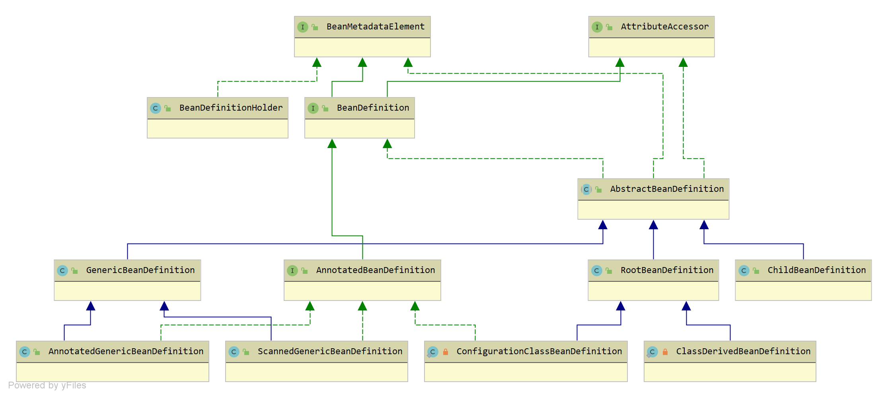

# Week3 Spring IoC

我们在 Spring 中通常以这两种方式定义一个 Bean：面向资源（XML、Properties）、面向注解。

## BeanDefinition

在 Spring Bean 的**生命周期**可以看到，BeanDefinition 可以说是 Bean 的“前身”，首先进入 Bean 的元信息的配置、解析和注册阶段，然后才开始 Bean 的实例化和初始化等工作。

BeanDefinition 是 Spring Framework 中定义 Bean 的配置元信息接口，主要包含一下信息：

- Bean 的类名
- Bean 行为配置类，如作用域、自动绑定模式、生命周期回调等
- 其他 Bean 引用，又可称作合作者或者依赖
- 配置设置，比如 Bean 属性

### BeanDefinition 体系结构

`org.springframework.beans.factory.config.BeanDefinition` 接口的类图如下所示：

- `org.springframework.core.AttributeAccessor` 接口，用于获取元数据，在实现类中通过 LinkedHashMap 集合保存元数据，例如通过 XML 的 `<meta />` 标签定义的一些元信息会保存在其中

- `org.springframework.beans.BeanMetadataElement` 接口，用于获取定义 Bean 的源对象，在实现类中通过 Object 对象保存，所谓的源对象就是定义这个 Bean 的资源（XML 标签对象或者 .class 文件资源对象）

- `org.springframework.beans.factory.config.BeanDefinition` 接口，定义一个 Bean 的元信息

- `org.springframework.beans.factory.support.AbstractBeanDefinition` 抽象类，实现BeanDefinition 接口，包含了一个 Bean 几乎所有的元信息

- `org.springframework.beans.factory.support.GenericBeanDefinition，继承 AbstractBeanDefinition` 抽象类，多了一个 parentName，表示有继承关系，是一个标准 Bean 元信息对象，通过 XML 定义的 Bean 会解析成该对象

- `org.springframework.beans.factory.annotation.AnnotatedBeanDefinition` 接口，继承BeanDefinition 接口，定义注解类的元信息，例如通过 `@Component` 注解定义的 Bean，那么注解类的元信息会包含编译后的 .class 文件的所有信息

- `org.springframework.context.annotation.ScannedGenericBeanDefinition`，继承 `GenericBeanDefinition`，实现 `AnnotatedBeanDefinition` 接口，多了一个 `AnnotationMetadata` 注解类元信息对象，例如通过 `@Component` 注解定义的 Bean 会解析成该对象

- `org.springframework.beans.factory.annotation.AnnotatedGenericBeanDefinition`，继承 `GenericBeanDefinition`，实现 `AnnotatedBeanDefinition` 接口，和 `ScannedGenericBeanDefinition` 类似，通过 @Import 导入的 Configuration Class 会解析成该对象

- `org.springframework.beans.factory.support.RootBeanDefinition`，继承 `AbstractBeanDefinition` 抽象类，表示合并后的BeanDefinition 对象。在 Spring BeanFactory 初始化 Bean 的前阶段，会根据BeanDefinition 生成一个 `RootBeanDefinition`（具有层次性则会进行合并），用于后续实例化和初始化

- `org.springframework.context.annotation.ConfigurationClassBeanDefinition$ConfigurationClassBeanDefinition` 私有静态类，继承 `RootBeanDefinition`，实现了 `AnnotatedBeanDefinition` 接口，和 `AnnotatedGenericBeanDefinition` 类似，没有继承关系，通过 `@Bean` 定义的方法会解析成该对象

- `org.springframework.beans.factory.config.BeanDefinitionHolder`，包含BeanDefinition、Bean 的名称以及别名（支持多个）

总结：

1. XML 定义 Bean >>>>> GenericBeanDefinition

2. @Component 以及派生注解定义 Bean >>>>> ScannedGenericBeanDefinition

3. 借助于 @Import 导入 Bean >>>>> AnnotatedGenericBeanDefinition

4. @Bean 定义的方法 >>>>> ConfigurationClassBeanDefinition

5. 在 Spring BeanFactory 初始化 Bean 的前阶段，会根据 BeanDefinition 生成一个合并后的 RootBeanDefinition 对象

## 加载 XML

看到 IoC 容器的使用过程大致如下：

1. 创建 `BeanFactory` 对象（底层 IoC 容器）
2. 创建 `BeanDefinitionReader` 对象（资源解析器），关联第 1 步创建的 `BeanFactory`
3. 通过 `BeanDefinitionReader` 加载 XML 配置文件资源，解析出所有的 `BeanDefinition` 对象进行依赖查找

上面的第 3 步会解析 `Resource` 资源，将 XML 文件中定义的 Bean 解析成 `BeanDefinition` 配置元信息对象，并往 `BeanDefinitionRegistry` 注册中心注册，此时并没有生成对应的 Bean 对象，需要通过依赖查找获取到 Bean。当然，我们在实际场景中一般不会这样使用 Spring，这些工作都会有 Spring 来完成。